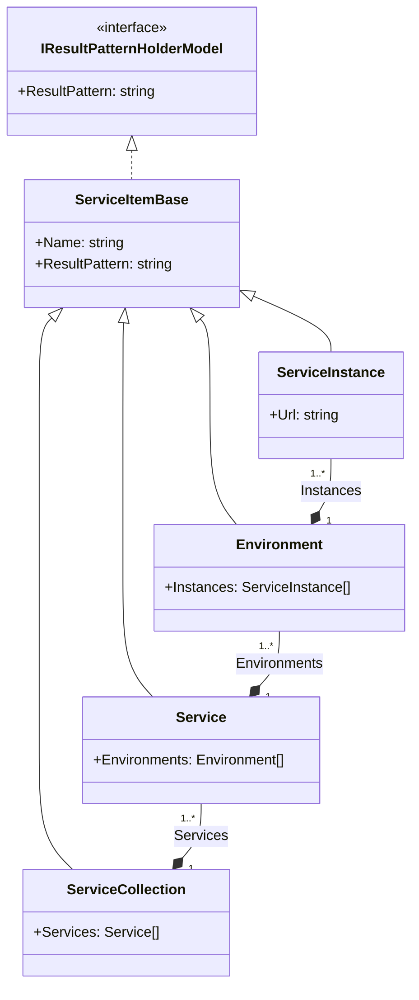

# ServiceHealthStatus

## Summary

ServiceHealthStatus is an application disigned to help check sevice health in a list of services. this is done by sending a http probe and displaying information that will indicate the status of that service.
My objective in writing this project were to improve my .net C# knowledge with new technologies and to practice the NVVM design pattern.
problem to solve:
The main problem I solve in this project is how to reach multiple services that are devided by different regions and environments effectively. the second problem is displaying the results of the probe on multiple platforms (currently windows desktop and web).
another problem I encountered is simulating a webserver so I could display the project usage in the link below.
learn new technologies:
In this project I improved my knowledge in C# with using WPF for desktop user interface and OpenSilver for web .
In addition I learned how to use dependency injection in for a better ViewModel ..?
project model:

### Service 
I practiced sending http requests and parsing the response for the data I need
view model diagram:

### Devops 
In this project I improved my knowledge in using github by learning  how to use PR Merge for double checking code with a peer.
 I learned how to use github inbuilt deploy feature to deploy my code as i push it to the main branch
I learned how to use Azure to simulate a webserver 
## Model
UML diagram of the model:

example of desired input json is ServiceInputExample.json